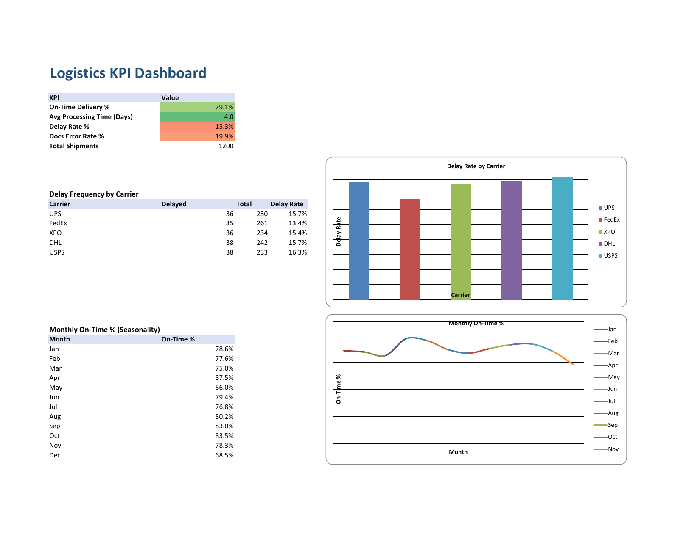
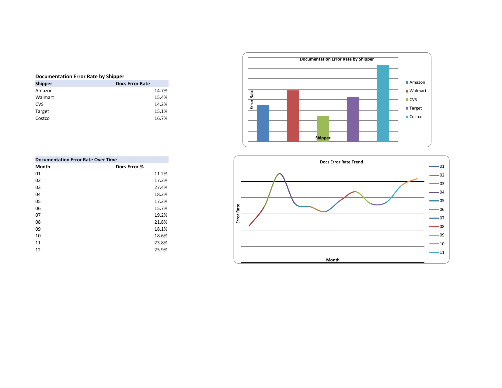

# Logistics Shipment Tracking & KPI Analysis

## Project Overview

This project demonstrates an Excel-based logistics shipment tracking and performance analysis workflow using a dataset of 1,200 shipments. It combines shipment tracking, KPI monitoring, carrier performance analysis, seasonality review, and documentation-error analysis in a practical logistics operations portfolio.

The goal is to turn shipment-level operational data into clear performance indicators that can support day-to-day logistics decisions, exception management, carrier review, and process improvement.

## Dashboard Preview



## Key KPIs

| KPI | Result |
| --- | ---: |
| Total Shipments | 1,200 |
| On-Time Delivery | 79.1% |
| Average Processing Time | 4.0 days |
| Delay Rate | 15.3% |
| Documentation Error Rate | 19.9% |

## Analysis Areas

### 1. Shipment Tracking
The workbook provides a structured way to track shipment activity and operational status, including carrier activity, shipment milestones, delivery performance, and exceptions.

### 2. Carrier Delay Analysis
Carrier-level delay frequency and delay rates are summarized to make performance differences easier to identify and review.

### 3. Monthly On-Time Performance
Monthly on-time percentages are analyzed to identify seasonality and periods of weaker or stronger delivery performance.

### 4. Documentation Accuracy
Documentation error rates are reviewed by shipper and over time to identify recurring accuracy issues and potential process-improvement opportunities.



## Logistics Competencies Demonstrated

- Shipment Tracking & ETA/ATA Updates
- Vendor & Carrier Communication
- Documentation Accuracy (B/L, CI, PL)
- Excel-Based Operational Analysis
- Issue Resolution & Delay Management
- Process Improvement
- Inventory & WIP Tracking
- KPI Monitoring and Reporting

## Tools & Skills

- Microsoft Excel
- Data Cleaning and Organization
- KPI Development
- Logistics Performance Analysis
- Carrier Performance Analysis
- Trend and Seasonality Analysis
- Data Visualization
- Operational Reporting

## Business Use Cases

This type of dashboard can help logistics and supply-chain teams monitor shipment performance, identify recurring delays, compare carrier results, track documentation quality, communicate exceptions, and focus improvement efforts on measurable operational issues.

## Repository Structure

```text
logistics-shipment-kpi-analysis/
├── README.md
├── data/
│   └── shipment_tracking_with_kpis.xlsx
├── dashboard/
│   └── Logistics_KPI_Dashboard.pdf
├── documentation/
│   └── Logistics_Coordinator_Portfolio.docx
└── images/
    ├── dashboard_overview.png
    └── documentation_error_analysis.png
```

## Files

- **Excel workbook:** `data/shipment_tracking_with_kpis.xlsx` - shipment data, KPI calculations, and analysis workbook.
- **Dashboard PDF:** `dashboard/Logistics_KPI_Dashboard.pdf` - portable two-page view of the KPI dashboard and documentation analysis.
- **Portfolio document:** `documentation/Logistics_Coordinator_Portfolio.docx` - overview of logistics competencies and featured work.

## Portfolio Context

This project is intended to demonstrate the combination of logistics operations knowledge and practical data-analysis skills, with an emphasis on converting operational shipment data into clear, actionable information.
